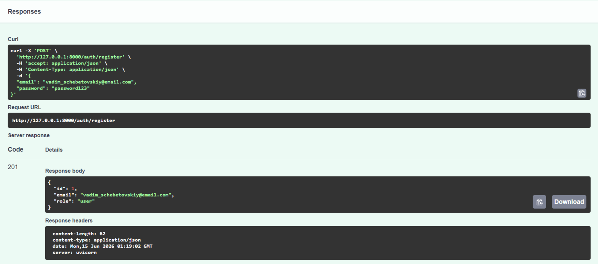
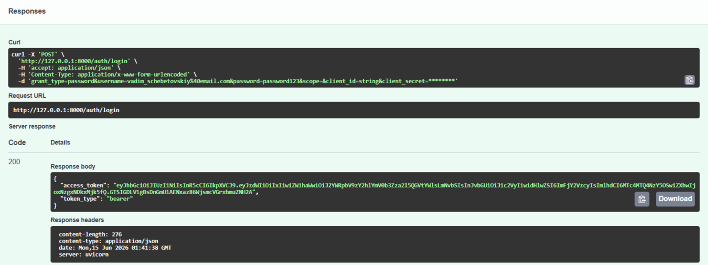
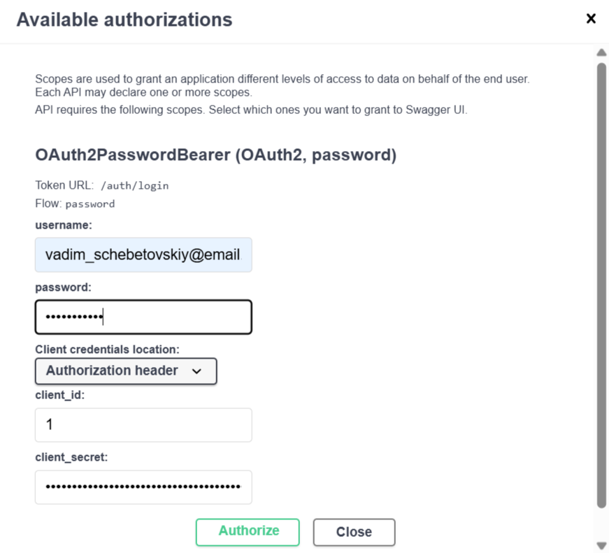
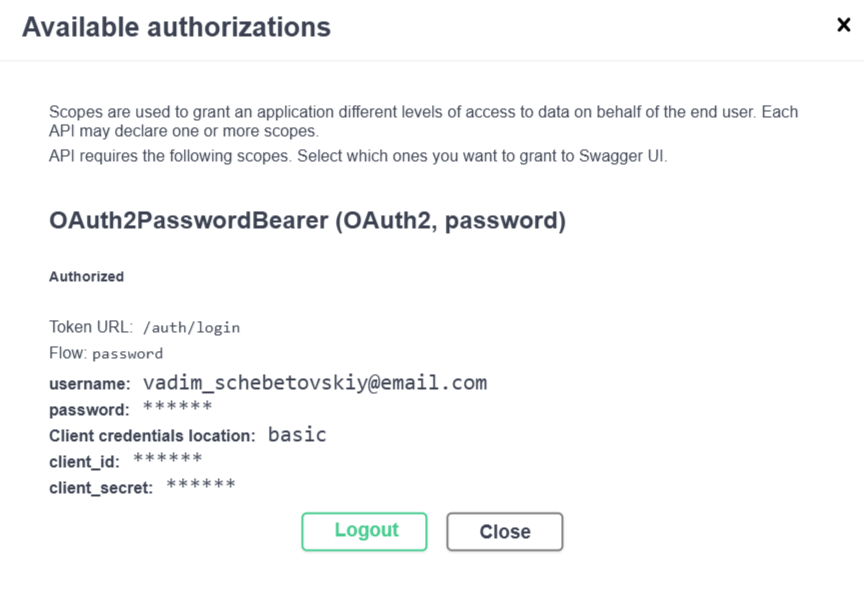
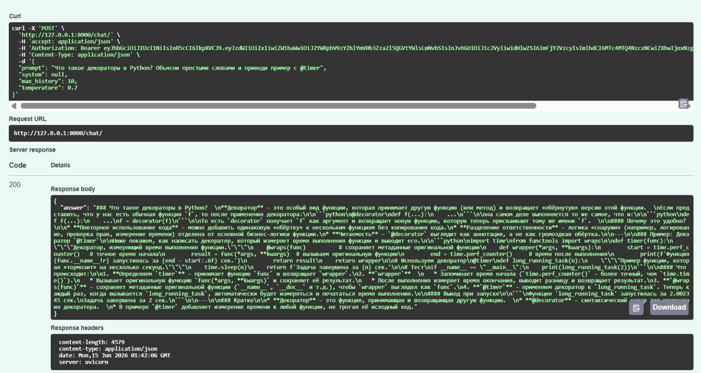
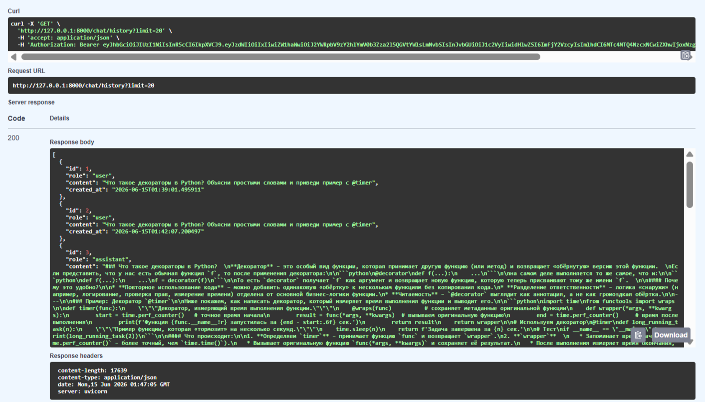
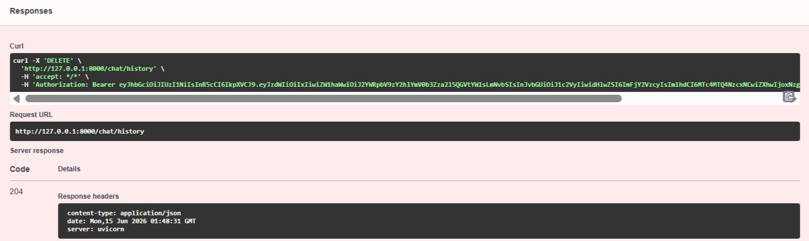

# LLM-P: Защищённое API для работы с LLM через OpenRouter

Проект представляет собой серверное приложение на FastAPI, предоставляющее защищённый API для взаимодействия с большой языковой моделью (LLM) через сервис OpenRouter. Включает аутентификацию и авторизацию пользователей с использованием JWT, хранение данных в SQLite и полное разделение слоёв приложения (API → UseCases → Repositories → DB / Services).

---

## Структура проекта

```
llm-p/
│
├── app/
│ ├── __init__.py
│ ├── main.py # Точка входа FastAPI
│ │
│ ├── core/ # Общие компоненты и инфраструктура
│ │ ├── __init__.py
│ │ ├── config.py # Конфигурация приложения (env → Settings)
│ │ ├── security.py # JWT, хеширование паролей
│ │ └── errors.py # Доменные исключения
│ │
│ ├── db/ # Слой работы с БД
│ │ ├── __init__.py
│ │ ├── base.py # DeclarativeBase
│ │ ├── session.py # Async engine и sessionmaker
│ │ └── models.py # ORM-модели (User, ChatMessage)
│ │
│ ├── schemas/ # Pydantic-схемы (вход/выход API)
│ │ ├── __init__.py
│ │ ├── auth.py # Регистрация, логин, токены
│ │ ├── user.py # Публичная модель пользователя
│ │ └── chat.py # Запросы и ответы LLM
│ │
│ ├── repositories/ # Репозитории (ТОЛЬКО SQL/ORM)
│ │ ├── __init__.py
│ │ ├── users.py # Доступ к таблице users
│ │ └── chat_messages.py # Доступ к истории чатов
│ │
│ ├── services/ # Внешние сервисы
│ │ ├── __init__.py
│ │ └── openrouter_client.py # Клиент OpenRouter / LLM
│ │
│ ├── usecases/ # Бизнес-логика приложения
│ │ ├── __init__.py
│ │ ├── auth.py # Регистрация, логин, профиль
│ │ └── chat.py # Логика общения с LLM
│ │
│ └── api/ # HTTP-слой (тонкие эндпоинты)
│ ├── __init__.py
│ ├── deps.py # Dependency Injection
│ ├── routes_auth.py # /auth/*
│ └── routes_chat.py # /chat/*
│
├── .env # Переменные окружения (не в git)
├── .env.example # Пример переменных окружения
├── pyproject.toml # Зависимости проекта (uv)
├── README.md
├── app.db # SQLite база (создаётся при запуске)
└── .gitignore
```

---

## Начало работы

### 1. Настройка переменных окружения
Скопируйте .env.example в .env и заполните пустые значения

### 2. Установка uv

```bash
pip install uv
```

### 3. Инициализация проекта и установка зависимостей

Перейдите в директорию проекта

```bash
cd llm-p
```

Создание виртуального окружения

```bash
uv venv
```

Активация виртуального окружения
- Windows:
    ```bash
    .venv\Scripts\activate.bat
    ```
- MacOS/Linux:
    ```bash
    source .venv/bin/activate
    ```

Установка зависимостей

```bash
uv pip install -r <(uv pip compile pyproject.toml)
```

### 4. Запуск приложения

```bash
uv run uvicorn app.main:app --reload --host 0.0.0.0 --port 8000
```

После запуска Swagger документация доступна по адресу: http://localhost:8000/docs

### 5. Проверка работоспособности

```bash
curl http://localhost:8000/health
```

Ожидаемый ответ: {"status":"ok","environment":"local"}

---

## Демонстрация работы API

### 1. Регистрация пользователя



**Важно: используется email vadim_schebetovskiy@email.com**

### 2. Логин и получение JWT токена



### 3. Авторизация в Swagger




### 4. Отправка запроса к LLM



### 5. Получение истории диалога



### 6. Очистка истории диалога



---

## Контакты

Автор: Shchebetovskii V.A.

Группа: M25-555